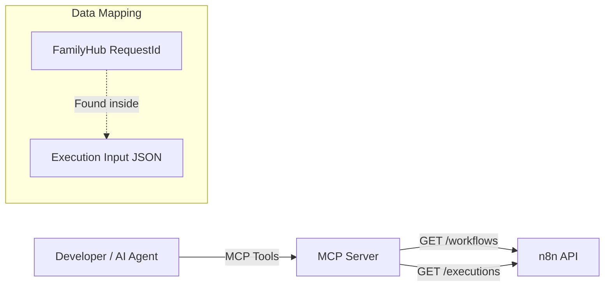

# MCP Observability for n8n

## 1. Overview
This document defines the Model Context Protocol (MCP) interface for n8n observability within the FamilyHub ecosystem.
**Goal**: Enable read-only inspection of workflows and executions to answer "What happened to requestId X?" without accessing the n8n UI.

### 1.1 Scope & Constraints
-   **Read-Only**: No creation, update, deletion, or triggering of workflows.
-   **No Secrets**: Credentials are never exposed.
-   **No Side Effects**: Inspection must not alter runtime state.

---

## 2. Architecture & Data Flow

### 2.1 The Observability Gap
FamilyHub (Brain) sends commands to n8n (Muscles) via Webhook.
-   **FamilyHub** logs `requestId` and `workflow` ID.
-   **n8n** executes logic.
-   **Gap**: Currently, tracing a `requestId` requires manual login to n8n UI and searching execution logs.

### 2.2 Solution: MCP Integration
The MCP Server connects to the n8n Public API to fetch execution history and metadata.

---

## 3. Tool Definitions

The following tools are exposed to the MCP Client (e.g., Clause/IDE).

### 3.1 `list_workflows`
List all active workflows in the n8n instance to understand available capabilities.

-   **Input**: `active` (boolean, optional, default: `true`)
-   **Output**: List of workflows `{ id, name, active, createdAt, updatedAt }`
-   **Description**: "List all workflows in n8n. Use this to find the workflowId for a given name (e.g., 'calendar.create')."

### 3.2 `get_workflow_executions`
Retrieve recent executions for a specific workflow or globally.

-   **Input**:
    -   `workflowId` (string, optional): Filter by specific workflow.
    -   `status` (string, optional): Filter by `success`, `error`, `waiting`.
    -   `limit` (number, optional, default: 10): Number of executions to return.
-   **Output**: List of executions `{ id, workflowId, startedAt, stoppedAt, status, mode }`.
-   **Description**: "Get recent execution IDs. Use this to find a specific execution to inspect."

### 3.3 `get_execution_details`
Deep dive into a single execution to inspect inputs, outputs, and errors.

-   **Input**:
    -   `executionId` (string, required): The ID of the execution.
-   **Output**: Detailed JSON including:
    -   `data.resultData.runData`: Node-by-node execution steps.
    -   `data.startData.body`: The original Webhook payload (including `requestId`).
-   **Description**: "Get full details of an execution. **Critical:** Use this to verify if `context.requestId` matches the FamilyHub request."

---

## 4. Request Tracing Strategy (The "60-Second" Workflow)

To answer: *"What happened to requestId `req-123`?"*

1.  **Identify Workflow**:
    -   If known (e.g., `calendar.create` -> `WF-102`), proceed.
    -   If unknown, call `list_workflows` to find the ID.
2.  **Scan Executions**:
    -   Call `get_workflow_executions(workflowId=WF_ID, limit=20)`.
3.  **Find Request**:
    -   *Challenge*: n8n API may not support filtering by body content directly.
    -   *Strategy*: Iterate through the recent `executionId`s, calling `get_execution_details(executionId)` until `data.startData.body.context.requestId === req-123` is found.
    -   *Optimization*: Filter by time window (approximate request time).

---

## 5. Security & Safety

### 5.1 Read-Only Enforcement
-   The MCP Server MUST be configured with an n8n API Key that has **limited scope** if possible (n8n Enterprise features) or the MCP implementation itself must **strictly allow only GET requests**.
-   **No Input Sanitization**: The MCP tool must not execute arbitrary code or SQL.

### 5.2 Credential Redaction
-   **Rule**: The MCP tool MUST assume execution data might contain secrets (though they shouldn't be in payload).
-   **Mitigation**: If specific nodes (e.g., `HTTP Request` with Authorization headers) are inspected, the tool provider should attempt to mask known header keys (`Authorization`, `X-Api-Key`). *Note: n8n usually masks credential store usage, but plaintext headers in nodes are visible.*

---

## 6. Verification Checklist

- [ ] **Connectivity**: Can the MCP server reach the n8n API?
- [ ] **Auth**: Is the API Key valid?
- [ ] **List**: Does `list_workflows` return the expected `WF-102` and `WF-103`?
- [ ] **Inspect**:
    -   Trigger a workflow via FamilyHub (or curl).
    -   Call `get_workflow_executions`.
    -   Call `get_execution_details` on the new ID.
    -   Verify `requestId` is visible in the returned JSON.
- [ ] **Negative Test**: Verify `delete_workflow` or `create_workflow` tools are **NOT** available.
