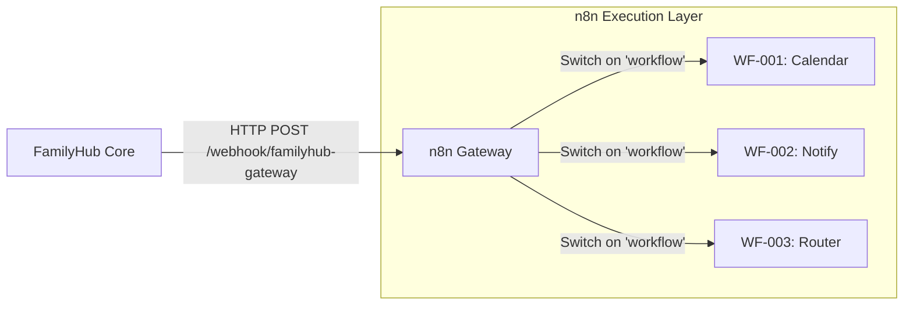

# n8n Integration & Contract

**Version**: 1.0.0
**Status**: Active
**Last Updated**: 2025-12-20

## 1. Overview & Philosophy

The FamilyHub system follows a strict **"Brain vs. Muscles"** architecture (SR-004).

-   **FamilyHub (The Brain)**: Handles intent classification, context management, and user interface. It is **stateless** regarding external execution and keyless (does not hold 3rd party credentials).
-   **n8n (The Muscles)**: The exclusive execution layer for all side effects (calendar writes, notifications, home automation). It holds credentials and handles retries/reliability.

### 1.1 Authority
-   **Routing**: The `workflow` field in the request is authoritative. n8n must not guess the intent.
-   **Credentials**: Hosted solely in n8n Credentials store.
-   **Retries**: Handled by n8n Error Triggers. FamilyHub expects an immediate ACK or a final result, but does not implement complex backoff logic.

---

## 2. Integration Architecture

Communication is done via a **Single Gateway Webhook**.



### 2.1 Endpoint
-   **URL**: `http://192.168.178.20:5678/webhook/familyhub-gateway`
-   **Method**: `POST`
-   **Auth**: Header `X-FamilyHub-Auth` (Shared Secret)

---

## 3. The Contract (v1)

### 3.1 Versioning Strategy
-   **Semantic Versioning**: The contract is versioned (currently `v1`).
-   **Forward Compatibility**: 
    -   New optional fields in the Request/Response will not break v1.
    -   Breaking changes (field removal, structure change) will require a new endpoint `/webhook/familyhub-gateway-v2`.
    -   n8n Gateway can implement parallel routers for v1 and v2 if needed during migration.

### 3.2 Standard Request Envelope
Every request from FamilyHub MUST adhere to this structure.

```json
{
  "workflow": "calendar.create", 
  "payload": {
    // Workflow-specific parameters (free-form object)
    "summary": "Dentist Appointment",
    "start": "2025-12-21T10:00:00Z"
  },
  "context": {
    "requestId": "uuid-v4-string",
    "source": "voice|chat|automation",
    "userId": "string",
    "locale": "en-US|de-DE"
  }
}
```

**Fields:**
-   `workflow` (Required): The unique ID of the target workflow (e.g., `calendar.create`). This is **authoritative** for routing.
-   `payload` (Required): Data required for execution.
-   `context` (Required): metadata for auditing and simple responses.

### 3.3 Standard Response Envelope
n8n MUST return this structure.

**Success**:
```json
{
  "status": "success",
  "data": {
    // Result of the operation
    "eventId": "12345"
  }
}
```

**Error**:
```json
{
  "status": "error",
  "error": {
    "code": "resource_conflict",
    "message": "Double booking detected",
    "retryable": false
  }
}
```

---

## 4. Workflow Registry

### WF-001: Calendar Actions
-   **ID**: `calendar.action`
-   **Sub-actions**: `create`, `delete`, `update` (passed in payload)
-   **Description**: Proxy to Baikal/CalDAV.
-   **Behavior**:
    1.  Validate input.
    2.  Execute CalDAV write.
    3.  (Mock) Notify Home Assistant.

### WF-002: Notification & Reminders
-   **ID**: `reminder.schedule`
-   **Description**: Schedule future notifications.
-   **Behavior**:
    1.  Log the request.
    2.  (Log Only) Pretend to send Mobile App notification.

### WF-003: Action Router
-   **ID**: `action.router`
-   **Description**: Generic dispatcher for simple one-off actions not requiring dedicated flows.

---

## 5. Error & Retry Philosophy

1.  **FamilyHub** sends the request **once**.
2.  If n8n returns `200 OK` (even with application error), the message was delivered.
3.  If HTTP `5xx` or Timeout: FamilyHub may show "System Unreachable" but SHOULD NOT auto-retry complex mutations to avoid ghost writes.
4.  **n8n** is responsible for retrying downstream services (e.g., if Baikal is down, n8n retries the CalDAV PUT).
